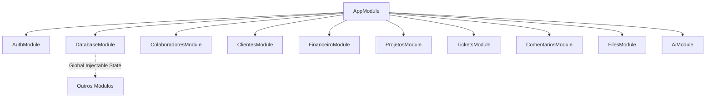

# 📘 Documentação de Desenvolvimento do Backend — NEXA

Esta documentação serve como guia técnico oficial do backend da **NEXA** (desenvolvido em **NestJS & TypeScript**). O objetivo é facilitar a manutenção, onboarding de novos desenvolvedores, evolução do código e futura migração de dados.

---

## 🏗️ 1. Arquitetura Geral & Estrutura

O backend segue a arquitetura modular padrão do **NestJS**, altamente escalável e tipada. 



### 📂 1.1. Estrutura de Diretórios
- `src/auth/`: Lógica de criptografia, geração de JWT, guards de autenticação e perfis de controle de acesso (RBAC).
- `src/database/`: Provedor central global de persistência e semeadura automática do arquivo `database.json`.
- `src/colaboradores/`: Gestão e cadastro de estagiários (Níveis 1, 2 e 3) e professores.
- `src/clientes/`: Gestão de empresas clientes parceiras.
- `src/financeiro/`: Lançamento financeiro de receitas e despesas, relatórios consolidados e metas individuais de rentabilidade.
- `src/projetos/`: Criação de projetos, alocação de membros, gestão de demandas e atualizações de status.
- `src/tickets/`: Sistema de suporte de chamados e troca de respostas.
- `src/comentarios/`: Pareceres pedagógicos e comentários de professores.
- `src/files/`: Módulo de upload de arquivos com validação dupla e persistência física.
- `src/ai/`: Integração com o Google Gemini.

---

## 💾 2. Banco de Dados Local & Persistência (`database.json`)

Para viabilizar uma execução ágil, leve e portátil na máquina local (sem requerer bancos de dados pesados pré-instalados na máquina do desenvolvedor), criamos uma **camada de persistência local baseada em JSON**:

- **Local de gravação**: `backend/uploads/database.json`.
- **Funcionamento**: O `DatabaseService` (`src/database/database.service.ts`) atua como provedor em memória global. Na inicialização (`onModuleInit`), ele verifica a presença de `database.json`:
  1. **Se não existir**: O banco cria e semeia automaticamente todos os dados iniciais do sistema (estagiários, clientes, projetos, demandas, movimentações financeiras) idênticos ao mock do frontend, gravando-os em disco.
  2. **Se existir**: Carrega os dados reais modificados pelas sessões anteriores.
- **Mutabilidade**: Qualquer operação de alteração (criação de projetos, novo chamado, lançamentos) chama `this.db.saveState()`, que persiste as alterações fisicamente de forma síncrona no arquivo JSON.

> [!NOTE]
> Essa arquitetura garante **100% de persistência de dados real** durante o desenvolvimento. Se o servidor for reiniciado, nenhum dado inserido nas telas do Next.js é perdido.

---

## 🔒 3. Autenticação & Segurança (RBAC)

O sistema de segurança está baseado em **Tokens JWT** e no padrão **RBAC (Role-Based Access Control)**.

### 🛡️ 3.1. Perfis de Acesso (Roles)
Definidos em `src/auth/enums/user-role.enum.ts`:
- `NIVEL_1`: Estagiário Júnior. Visualização restrita a seus próprios projetos.
- `NIVEL_2`: Estagiário Sênior. Visualização corporativa, edição de status de demandas, envio de uploads e respostas a chamados.
- `NIVEL_3`: Gestor / Administrador. Controle total do sistema (financeiro corporativo, CRUD de projetos/clientes/colaboradores).
- `PROFESSOR`: Supervisor Pedagógico. Visualização geral do andamento e postagem de orientações acadêmicas.
- `CLIENTE`: Empresa parceira. Acesso limitado aos seus próprios projetos, contratos e abertura de chamados.

### 🔑 3.2. Como Proteger Endpoints
A proteção é declarativa por meio de **Guards** e **Decorators** no controller:

```typescript
@Controller('recurso')
@UseGuards(JwtAuthGuard, RolesGuard) // Ativa a verificação JWT e validação de Roles
export class RecursoController {

  @Post()
  @Roles(Role.NIVEL_3) // Apenas Gestores podem disparar esta rota
  criar(@Body() dto: CriarDto) {
    return this.service.criar(dto);
  }
}
```

---

## 📋 4. Referência de APIs (Endpoints)

Todas as requisições (exceto login) exigem o Header `Authorization: Bearer <JWT_TOKEN>`.

### 🔑 4.1. Módulo de Autenticação (`/auth`)
- `POST /auth/login`: Autentica o usuário e retorna o perfil e o token Bearer.
  - **Payload**: `{ "email": "estagiario@nexa.com", "password": "est123" }`

### 👥 4.2. Módulo de Colaboradores (`/colaboradores`)
*Apenas para perfis `NIVEL_3` (escrita) e `PROFESSOR` (leitura).*
- `GET /colaboradores`: Lista estagiários e professores.
- `GET /colaboradores/:id`: Detalha um colaborador.
- `POST /colaboradores`: Cadastra colaborador.
- `PATCH /colaboradores/:id`: Atualiza dados.
- `DELETE /colaboradores/:id`: Remove colaborador.

### 🏢 4.3. Módulo de Clientes (`/clientes`)
*Acesso restrito para Gestores (`NIVEL_3`) e leitura para `NIVEL_2` e `PROFESSOR`.*
- `GET /clientes`: Lista empresas clientes.
- `GET /clientes/:id`: Detalha um cliente.
- `POST /clientes`: Cadastra empresa parceira.
- `PATCH /clientes/:id`: Atualiza dados corporativos.
- `DELETE /clientes/:id`: Remove cliente.

### 💰 4.4. Módulo Financeiro (`/financeiro`)
- `GET /financeiro`: Lista transações. Aceita filtros de Query: `type`, `status`, `projectId`, `month` (*Apenas Nível 2 e 3*).
- `POST /financeiro`: Lança nova receita ou despesa (*Apenas Nível 3*).
- `GET /financeiro/stats`: Soma receitas e despesas com status `PAID`, retornando saldo líquido (*Apenas Nível 2 e 3*).
- `GET /financeiro/rentabilidade/:userId`: Metas de produtividade financeira e metas mensais do estagiário solicitado (*Todos os perfis*).

### 📁 4.5. Módulo de Projetos, Membros e Demandas (`/projetos` & `/demandas`)
- `GET /projetos`: Lista projetos corporativos.
  - **RBAC Rígido**: Se o usuário logado for `NIVEL_1`, ele vê **apenas** os projetos nos quais está ativamente alocado como membro.
- `POST /projetos`: Cadastra projeto (*Apenas Nível 3*).
- `GET /projetos/:id`: Detalha projeto com membros (aninhando o perfil do usuário) e demandas (aninhando arquivos anexados).
  - **Segurança**: Bloqueia visualizações de Nível 1 caso ele tente acessar a ID de um projeto no qual não é membro.
- `POST /projetos/:id/membros`: Aloca colaborador ao projeto com produtividade/progresso iniciais (*Apenas Nível 3*).
- `POST /projetos/:id/demandas`: Cria nova demanda com prazo no projeto (*Apenas Nível 3*).
- `PATCH /demandas/:id`: Atualiza status da demanda (`PENDING`, `IN_PROGRESS`, `REVIEW`, `COMPLETED`) (*Nível 2, 3 e Professor*).

### 🎫 4.6. Módulo de Suporte & Chamados (`/tickets`)
- `GET /tickets`: Lista chamados.
  - **RBAC Rígido**: Se for `CLIENTE`, retorna **apenas** os tickets abertos por ele mesmo.
- `POST /tickets`: Abre chamado (*Clientes, Estagiários*).
- `GET /tickets/:id`: Detalha histórico e respostas do ticket.
- `POST /tickets/:id/respostas`: Envia nova mensagem no chat do ticket (*Todos os perfis envolvidos*).
- `PATCH /tickets/:id/status`: Altera status do ticket (*Nível 2, 3 e Professor*).

### 🧑‍🏫 4.7. Módulo Pedagógico (`/comentarios`)
- `GET /comentarios/estagiario/:id`: Lista os pareceres e avaliações pedagógicas de um estagiário específico.
- `POST /comentarios`: Registra parecer pedagógico (*Apenas Professor*).
  - **Payload**: `{ "targetId": "u-002", "comment": "Texto do professor..." }`

### 📤 4.8. Módulo de Uploads (`/files`)
- `POST /files/upload/:demandId/:subfolder`: Efetua o upload físico.
  - **RBAC**: Estagiários Nível 1 não têm permissão de upload.
  - **Validação de ZIP**: Se `:subfolder === 'zip'`, o backend aplica dupla checagem rígida: rejeita extensões diferentes de `.zip` e MIME types incompatíveis com `application/zip` (ex: bloqueia `.rar`, `.7z` de imediato).

### 🤖 4.9. Assistente Nexa AI (`/ai`)
- `POST /ai/search`: Envia a pergunta em linguagem natural. O backend injeta o contexto dinâmico do `database.json` no prompt e consulta o Google Gemini.
  - **Payload**: `{ "question": "Quanto faturamos no mês passado?" }`

---

## 🤖 5. Integração com o Google Gemini (AI Service)

A inteligência do **Nexa AI** usa o SDK oficial do **Google Gemini (gerado via chamadas REST nativas)** para evitar dependências pesadas de terceiros.

- **Modelo ativo**: `gemini-2.5-flash-lite` (configurado via `.env`).
- **Prompt com Injeção de Contexto**: A cada pergunta enviada pelo usuário, o `AiService` reconstrói um prompt contendo a base real do `database.json` em tempo de execução:
  - Listagem de Colaboradores e produtividades.
  - Status dos Projetos em andamento.
  - Estatísticas financeiras (Saldo líquido consolidado).
- **Tratamento de Exceções**: Se a chave do Gemini expirar ou atingir o limite do plano gratuito (Rate Limit), o backend captura a exceção de rede e repassa a mensagem de erro exata e amigável diretamente para o chat do usuário no frontend.

---

## 📈 6. Plano de Migração para PostgreSQL & Prisma ORM

Quando o projeto evoluir do modelo local persistente (`database.json`) para uma infraestrutura convencional em produção com **PostgreSQL**, a transição será extremamente limpa devido ao isolamento do código:

### Etapa 1: Modelar o Banco em `prisma/schema.prisma`
Crie as tabelas espelhando as entidades mapeadas nesta documentação. Exemplo:

```prisma
model User {
  id        String    @id @default(uuid())
  email     String    @unique
  name      String
  role      String
  cpfCnpj   String?
  isActive  Boolean   @default(true)
  createdAt DateTime  @default(now())
  updatedAt DateTime  @updatedAt
}

model Project {
  id          String   @id @default(uuid())
  name        String
  description String?
  deadline    DateTime
  status      String
  ownerId     String
  clientId    String?
}
```

### Etapa 2: Substituir o `DatabaseService`
1. Remova o `DatabaseService` global.
2. Crie um `PrismaService` conectando ao banco real por meio do Prisma Client.
3. Substitua nos serviços (ex: `financeiro.service.ts`, `projetos.service.ts`) a chamada `this.db.getProjects()` por queries assíncronas do Prisma: `await this.prisma.project.findMany()`.

Graças à separação dos controladores e serviços, **nenhuma rota ou regra de acesso do frontend precisará ser alterada** durante a migração do banco!

---

## 💻 7. Como Executar e Compilar o Backend

### Requisitos
- Node.js (v18+)
- Chave de API do Gemini no `.env` do backend (`GEMINI_API_KEY`)

### Comandos Úteis
```bash
# 1. Instalar dependências
npm install

# 2. Rodar em modo Watch (desenvolvimento)
npm run start:dev

# 3. Rodar testes
npm run test

# 4. Compilar para produção
npm run build
```
