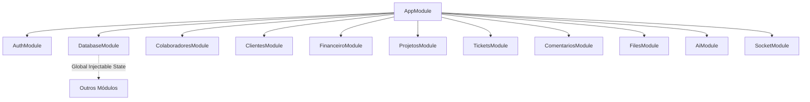

# 📘 Documentação de Desenvolvimento do Backend — NEXA

Esta documentação serve como guia técnico oficial do backend da **NEXA** (desenvolvido em **NestJS & TypeScript**). O objetivo é facilitar a manutenção, onboarding de novos desenvolvedores, evolução do código e futura migração de dados.

---

## 🏗️ 1. Arquitetura Geral & Estrutura

O backend segue a arquitetura modular padrão do **NestJS**, altamente escalável e tipada. 



### 📂 1.1. Estrutura de Diretórios
- `src/auth/`: Lógica de criptografia, geração de JWT, guards de autenticação e perfis de controle de acesso (RBAC).
- `src/database/`: Provedor central global de persistência e semeadura automática do arquivo `database.json`.
- `src/colaboradores/`: Gestão e cadastro de estagiários (Níveis 1, 2 e 3) e professores.
- `src/clientes/`: Gestão de empresas clientes parceiras.
- `src/financeiro/`: Lançamento financeiro de receitas e despesas, relatórios consolidados e metas individuais de rentabilidade.
- `src/projetos/`: Criação de projetos, alocação de membros, gestão de demandas e atualizações de status.
- `src/tickets/`: Sistema de suporte de chamados e troca de respostas.
- `src/comentarios/`: Pareceres pedagógicos e comentários de professores.
- `src/files/`: Módulo de upload de arquivos com lógica Multiparts (`FormData`), fallback em memória para desenvolvimento e suporte produtivo ao Supabase Storage.
- `src/socket/`: WebSockets via `socket.io` gerenciando as conexões em tempo real (`NotificationsGateway`) para disparar eventos para o front-end.
- `src/ai/`: Integração com o Google Gemini.

---

## 💾 2. Banco de Dados & Persistência (Prisma ORM & Supabase Cloud)

Para viabilizar uma execução robusta, segura e livre de dependências de infraestrutura local, o NEXA migrou do banco em arquivo simulado para o **Prisma ORM** integrado diretamente a uma instância **PostgreSQL 18** hospedada no **Supabase Cloud**:

- **Motor de Conexão**: O `PrismaService` (`src/database/prisma.service.ts`) gerencia as conexões utilizando o driver nativo `@prisma/adapter-pg` com pool de conexões estável.
- **Isolamento e Segurança (RLS)**: O `PrismaService` intercepta as queries em transações para propagar o contexto de sessão física do usuário (`app.current_user_id`, `app.current_user_role` e `app.crypto_key`) no PostgreSQL antes de cada consulta, ativando automaticamente o controle de auditoria por triggers e o isolamento de segurança Row-Level Security (RLS) no Supabase.
- **Criptografia LGPD**: Os dados sensíveis de colaboradores e clientes (como CPF e CNPJ) são cifrados e decifrados em tempo real usando a extensão `pgcrypto` (`pgp_sym_encrypt`/`pgp_sym_decrypt`) do PostgreSQL, restrita aos perfis autorizados de nível 3.


---

## 🔒 3. Autenticação & Segurança (RBAC)

O sistema de segurança está baseado em **Tokens JWT** e no padrão **RBAC (Role-Based Access Control)**.

### 🛡️ 3.1. Perfis de Acesso (Roles)
Definidos em `src/auth/enums/user-role.enum.ts`:
- `NIVEL_1`: Estagiário Júnior. Visualização restrita a seus próprios projetos.
- `NIVEL_2`: Estagiário Sênior. Visualização corporativa, edição de status de demandas, envio de uploads e respostas a chamados.
- `NIVEL_3`: Gestor / Administrador. Controle total do sistema (financeiro corporativo, CRUD de projetos/clientes/colaboradores).
- `PROFESSOR`: Supervisor Pedagógico. Visualização geral do andamento e postagem de orientações acadêmicas.
- `CLIENTE`: Empresa parceira. Acesso limitado aos seus próprios projetos, contratos e abertura de chamados.

### 🔑 3.2. Como Proteger Endpoints
A proteção é declarativa por meio de **Guards** e **Decorators** no controller:

```typescript
@Controller('recurso')
@UseGuards(JwtAuthGuard, RolesGuard) // Ativa a verificação JWT e validação de Roles
export class RecursoController {

  @Post()
  @Roles(Role.NIVEL_3) // Apenas Gestores podem disparar esta rota
  criar(@Body() dto: CriarDto) {
    return this.service.criar(dto);
  }
}
```

```

---

## 🛠️ 4. Tipagem Estrita & Qualidade de Código (Linting)

O projeto foi submetido a uma refatoração massiva para se alinhar com as melhores práticas corporativas de TypeScript, atingindo **zero erros de linter** nas categorias de segurança.

### 🧩 4.1. Remoção do `any` e DTOs
O uso do tipo inseguro `any` foi completamente banido dos Controllers e Services. O tráfego de dados obedece rigorosamente a **Data Transfer Objects (DTOs)** (ex: `CreateFinanceiroDto`, `UpdateDemandaDto`).
- **Validação de Injeção**: O `ValidationPipe` do NestJS está configurado com `whitelist: true`. Qualquer propriedade não mapeada nos DTOs enviada por clientes maliciosos é sumariamente limpa da memória antes de chegar à lógica de negócios, evitando *Mass Assignment Attacks*.

### 📦 4.2. Interfaces Centralizadas
Todo o mapeamento das entidades que transitam na memória e no JSON (como `User`, `Project`, `Ticket`, etc) está solidificado no arquivo global `src/database/interfaces/database.interfaces.ts`. Isso assegura que o Intellisense e o compilador alertem falhas precocemente antes mesmo de rodar os testes.

## 🛡️ 5. Proteções de Segurança Avançadas (OWASP Top 10)

O backend possui proteções específicas focadas na prevenção de falhas corporativas (baseadas na norma OWASP Top 10 - 2025):

- **Mitigação de XSS e Visualização de PDFs:** Todos os uploads físicos transitam pela rota de upload e, por enquanto, são cacheados na Memória (ou Bucket Supabase quando chaves reais estão ativas).
  * Criamos a rota de proxy segura `GET /files/download?key=...` e `/files/mock-download` (para fallback).
  * Essa proteção impede que usuários acessem arquivos arbitrários publicamente através de links adivinhados.
- **Configuração de Frameguard e CSP (Helmet):** Para autorizar o frontend a embutir visualizadores, foi adicionada a diretiva `frame-ancestors`.
- **Whitelist Restrita (Arquivos):** Apenas extensões estritas (`.png`, `.pdf`, `.zip`) são permitidas no `FilesController`.
- **Filtro Global de Exceções (`AllExceptionsFilter`):** Toda exceção 500 do servidor é capturada por este interceptor global. O `stack trace` verdadeiro e caminhos do Windows são limitados ao Logger do terminal, enquanto o Frontend recebe sempre uma resposta higienizada (JSON).
- **Log de Auditoria Forense (`AuditInterceptor`):** Rotas destrutivas e de mutação de estado (`POST`, `PUT`, `PATCH`, `DELETE`) são registradas no arquivo local `audit.log` com Timestamp, Endereço IP da máquina, e ID do Usuário, permitindo rastreabilidade exata de invasões.
- **Proteção Contra Força Bruta (`@Throttle`):** Enquanto toda a aplicação possui limitador de `100 req/min`, a rota de autenticação (`/auth/login`) aceita um máximo de `5 requisições por minuto` por IP.
- **Senhas Seguras:** A API restringe e recusa (através do regex `@Matches`) qualquer tentativa de criação de usuário cuja senha possua menos de 8 caracteres, sem no mínimo uma letra e um número. Todas são devidamente hasheadas antes da inserção em disco com `bcrypt`.

---

## ⚡ 6. Otimizações de Performance e Escalabilidade

Visando uma API reativa e que possa suportar múltiplos acessos simultâneos sem gargalos (*Event Loop Blocking*), implementamos as seguintes melhorias técnicas:

- **Compressão HTTP (GZIP/Brotli):** Instalado e ativado o middleware `compression`. Requisições grandes (como as de Listar Demandas e Projetos) são comprimidas em voo, economizando banda pesada da rede do cliente.
- **Paginação de Entidades:** Endpoints maciços (`/projetos`, `/financeiro`, `/tickets`) implementam Skip e Take do banco de dados, protegendo a API de consumo indiscriminado de RAM (Out of Memory).
- **Criptografia Assíncrona Total:** Funções nativamente síncronas do Node que paralisavam o núcleo (como `bcrypt.hashSync` e `bcrypt.compareSync`) foram refatoradas para seu equivalente em fila de Promessas (`await bcrypt.hash`). Isso impede que o servidor trave para dezenas de usuários cada vez que um fizer login ou alterar a senha.
- **Timeout Anti-Congelamento da IA:** A conexão RESTful do backend com o LLM (`Google Gemini`) agora trafega envelopada num `AbortController` de **15 segundos**. Se o servidor da nuvem engasgar, nós evitamos Vazamento de Memória e respondemos rapidamente ao frontend abortando o pacote e estourando `HttpStatus.GATEWAY_TIMEOUT`.

---

## 📋 7. Referência de APIs (Endpoints)

Todas as requisições (exceto login) exigem o Header `Authorization: Bearer <JWT_TOKEN>`.

### 🔑 7.1. Módulo de Autenticação (`/auth`)
- `POST /auth/login`: Autentica o usuário e retorna o perfil e o token Bearer.
  - **Payload**: `{ "email": "estagiario@nexa.com", "password": "est123" }`
  > *Nota:* `est123` é a senha legada do Mock. Para novos usuários, a API exige força bruta rigorosa (mínimo de 8 caracteres contendo letras e números).
- `POST /auth/change-password`: Altera a senha provisória obrigatória do usuário logado (primeiro acesso) por uma senha definitiva com hash bcrypt seguro.
  - **Payload**: `{ "newPassword": "SenhaSegura123!" }`
  - **Autorização**: Requer cabeçalho JWT Bearer válido.


### 👥 7.2. Módulo de Colaboradores (`/colaboradores`)
*Apenas para perfis `NIVEL_3` (escrita) e leitura para `PROFESSOR`, `NIVEL_2` e `NIVEL_1`.*
- `GET /colaboradores`: Lista estagiários e professores.
- `GET /colaboradores/:id`: Detalha um colaborador.
- `POST /colaboradores`: Cadastra colaborador (com senha provisória e flag de troca).
- `PATCH /colaboradores/:id`: Atualiza dados.
- `DELETE /colaboradores/:id`: Remove colaborador (transacional com limpeza de dependências).

### 🏢 7.3. Módulo de Clientes (`/clientes`)
*Acesso restrito para Gestores (`NIVEL_3`) e leitura para `NIVEL_2` e `PROFESSOR`.*
- `GET /clientes`: Lista empresas clientes.
- `GET /clientes/:id`: Detalha um cliente.
- `POST /clientes`: Cadastra empresa parceira.
- `PATCH /clientes/:id`: Atualiza dados corporativos.
- `DELETE /clientes/:id`: Remove cliente.

### 💰 7.4. Módulo Financeiro (`/financeiro`)
- `GET /financeiro`: Lista transações. Aceita filtros de Query: `type`, `status`, `projectId`, `month` (*Apenas Nível 3*).
- `POST /financeiro`: Lança nova receita ou despesa (*Apenas Nível 3*).
- `GET /financeiro/stats`: Soma receitas e despesas com status `PAID`, retornando saldo líquido (*Apenas Nível 3*).
- `GET /financeiro/rentabilidade/:userId`: Metas de produtividade financeira e metas mensais do estagiário solicitado (*Todos os perfis*).

### 📁 7.5. Módulo de Projetos, Membros, Demandas e Contratos (`/projetos` & `/demandas`)
- `GET /projetos`: Lista projetos corporativos.
  - **RBAC Rígido**: Se o usuário logado for `NIVEL_1`, ele vê **apenas** os projetos nos quais está ativamente alocado como membro.
- `POST /projetos`: Cadastra projeto (*Apenas Nível 3*).
- `GET /projetos/:id`: Detalha projeto com membros (aninhando o perfil do usuário) e demandas (aninhando arquivos anexados).
  - **Segurança**: Bloqueia visualizações de Nível 1 caso ele tente acessar a ID de um projeto no qual não é membro.
- `POST /projetos/:id/membros`: Aloca colaborador ao projeto com produtividade/progresso iniciais (*Nível 2 e Nível 3*).
- `DELETE /projetos/:id/membros/:userId`: Remove um colaborador da equipe do projeto, limpando transacionadamente todas as atribuições dele em demandas do mesmo projeto (*Nível 2 e Nível 3*).
- `POST /projetos/:id/demandas`: Cria nova demanda com prazo no projeto (*Apenas Nível 3*).
- `PATCH /demandas/:id`: Atualiza status da demanda (`PENDING`, `IN_PROGRESS`, `REVIEW`, `COMPLETED`) (*Nível 2, 3 e Professor*).
- `POST /projetos/:id/arquivos`: Vincula metadados de arquivos enviados fisicamente à base do projeto.
- `POST /projetos/:id/contratos`: Cria e associa um contrato em PDF ao projeto com status inicial `PENDING` e a URL de download físico do arquivo.
- `PATCH /projetos/:id/contratos/:contractId/assinar`: Registra a assinatura eletrônica do cliente e atualiza o status do contrato para `SIGNED`.

### 🎫 7.6. Módulo de Suporte & Chamados (`/tickets`)
- `GET /tickets`: Lista chamados.
  - **RBAC Rígido**: Se for `CLIENTE`, retorna **apenas** os tickets abertos por ele mesmo.
- `POST /tickets`: Abre chamado (*Clientes, Estagiários*).
- `GET /tickets/:id`: Detalha histórico e respostas do ticket.
- `POST /tickets/:id/respostas`: Envia nova mensagem no chat do ticket (*Todos os perfis envolvidos*).
- `PATCH /tickets/:id/status`: Altera status do ticket (*Nível 2, 3 e Professor*).

### 🧑‍🏫 7.7. Módulo Pedagógico (`/comentarios`)
- `GET /comentarios/estagiario/:id`: Lista os pareceres e avaliações pedagógicas de um estagiário específico.
- `POST /comentarios`: Registra parecer pedagógico (*Apenas Professor*).
  - **Payload**: `{ "targetId": "u-002", "comment": "Texto do professor..." }`

### 📤 7.8. Módulo de Uploads e Downloads (`/files`)
- `POST /files/upload/:projectId/:subfolder`: Efetua o upload físico do arquivo para o bucket privado do Supabase.
  - **Processamento Real**: Recebe o arquivo e o envia como Buffer ao bucket privado `nexa-files` no Supabase Storage.
  - **RBAC**: Estagiários Nível 1 não têm permissão de upload.
  - **Validação de Pastas**: Aceita apenas pastas estritamente definidas como `front`, `back`, `bd`, `imgs`, `git`, `commits`, `zip`, `referencias` e `contratos`.
  - **Validação de ZIP**: Se `:subfolder === 'zip'`, o backend aplica dupla checagem rígida: rejeita extensões diferentes de `.zip` e MIME types incompatíveis.
- `GET /files/download`: Proxy de download seguro de arquivos privados.
  - **Funcionamento**: Recebe a chave física do arquivo (`?key=...`), gera uma URL assinada no Supabase temporária (60 segundos) e redireciona o cliente.

### 🤖 7.9. Assistente Nexa AI (`/ai`)
- `POST /ai/search`: Envia a pergunta em linguagem natural. O backend injeta o contexto dinâmico do banco de dados (via Prisma) no prompt e consulta o Google Gemini.
  - **Payload**: `{ "question": "Quanto faturamos no mês passado?" }`

### 📊 7.10. Módulo do Sistema (`/sistema`)
*Apenas para perfis `NIVEL_3` (Administradores).*
- `GET /sistema/storage`: Retorna estatísticas reais de bytes ocupados na base relacional e na nuvem de armazenamento.
  - **Retorno**: `{ "databaseSizeBytes": 15478496, "bucketSizeBytes": 2049581 }`

---

## 🤖 8. Integração com o Google Gemini (AI Service)

A inteligência do **Nexa AI** usa o SDK oficial do **Google Gemini (gerado via chamadas REST nativas)** para evitar dependências pesadas de terceiros.

- **Modelo ativo**: `gemini-2.5-flash-lite` (configurado via `.env`).
- **Prompt com Injeção de Contexto**: A cada pergunta enviada pelo usuário, o `AiService` reconstrói um prompt contendo a base real do banco PostgreSQL em tempo de execução:
  - Listagem de Colaboradores e produtividades.
  - Status dos Projetos em andamento.
  - Estatísticas financeiras (Saldo líquido consolidado).
- **Tratamento de Exceções**: Se a chave do Gemini expirar ou atingir o limite do plano gratuito (Rate Limit), o backend captura a exceção de rede e repassa a mensagem de erro exata e amigável diretamente para o chat do usuário no frontend.

---

## 📈 9. Conclusão da Migração e Persistência em Nuvem

A transição de banco simulado (`database.json`) para banco de dados relacional real está **100% concluída**:
- **Conectividade**: A `DATABASE_URL` configurada no `.env` do backend aponta diretamente para o pooler transacional (porta `5432` / `6543`) do Supabase Cloud.
- **Triggers e SLAs**: O cálculo dinâmico de prazos de suporte (SLA), validação de tipos de usuários, assinaturas digitais imutáveis e verificação forense foram movidos com segurança para funções PL/pgSQL nativas no banco, garantindo alta performance e segurança rígida.
- **Blindagem no Frontend**: Implementado o helper `safeIsoString` e tratamento de formatação flexível na camada visual para que datas malformadas históricas no banco de dados não quebrem as interfaces React 19 / Next.js.


---

## 💻 10. Como Executar e Compilar o Backend

### Requisitos
- Node.js (v18+)
- Chave de API do Gemini no `.env` do backend (`GEMINI_API_KEY`)

### Comandos Úteis
```bash
# 1. Instalar dependências
npm install

# 2. Rodar em modo Watch (desenvolvimento)
npm run start:dev

# 3. Rodar testes
npm run test

# 4. Compilar para produção
npm run build
```
