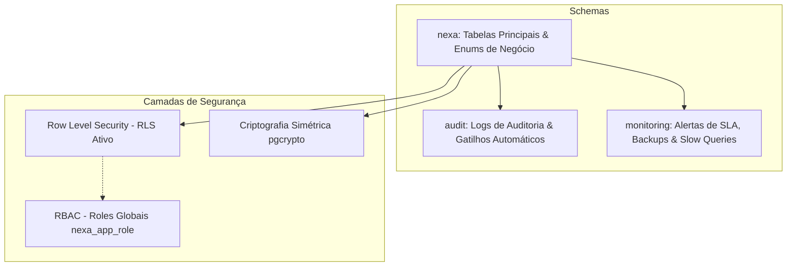
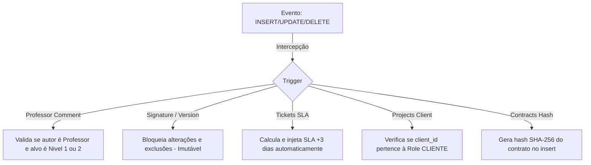

# 🗄️ Documentação de Engenharia de Banco de Dados — NEXA

Esta documentação serve como guia técnico oficial da modelagem, infraestrutura e arquitetura de banco de dados da **NEXA** (desenvolvido em **PostgreSQL 18**). O banco foi planejado sob os mais rígidos padrões de segurança e performance, contando com controle de acesso baseado em níveis (RBAC + RLS), criptografia simétrica de dados sensíveis, auditoria forense por gatilhos, e monitoramento ativo de SLAs.

---

## 🏗️ 1. Arquitetura Geral & Schemas

O banco de dados é estruturado de forma lógica e física utilizando **Schemas** para isolar as responsabilidades do sistema de negócio, auditoria histórica e monitoramento de infraestrutura.



### 📂 1.1. Schemas do Sistema
- `nexa`: Contém as tabelas centrais da regra de negócios (usuários, projetos, finanças, chamados, contratos, entregas e metas).
- `audit`: Contém a infraestrutura de gravação histórica de mutações do banco, isolada de acessos diretos do aplicativo.
- `monitoring`: Armazena metadados de diagnóstico de performance, logs de backup e monitoramento em tempo real de chamados atrasados.

---

## 📊 2. Tipos Enumerados (Enums)

Para manter a consistência estrita dos status e papéis em toda a camada da aplicação, a base implementa os seguintes enums nativos:

| Nome do Enum | Valores Permitidos | Contexto de Uso |
| :--- | :--- | :--- |
| `nexa.user_role` | `'NIVEL_1'`, `'NIVEL_2'`, `'NIVEL_3'`, `'PROFESSOR'`, `'CLIENTE'` | Controle de permissão de acessos (RBAC). |
| `nexa.project_status` | `'ACTIVE'`, `'PAUSED'`, `'COMPLETED'`, `'CANCELLED'` | Ciclo de vida dos projetos. |
| `nexa.demand_status` | `'PENDING'`, `'IN_PROGRESS'`, `'REVIEW'`, `'COMPLETED'` | Progresso e validação de demandas de estagiários. |
| `nexa.demand_subfolder`| `'front'`, `'back'`, `'bd'`, `'imgs'`, `'git'`, `'commits'`, `'zip'`, `'referencias'`, `'contratos'` | Classificação e roteamento de arquivos físicos. |
| `nexa.contract_status` | `'PENDING'`, `'APPROVED'`, `'REJECTED'` | Status do fluxo de análise de contratos. |
| `nexa.ticket_status` | `'OPEN'`, `'IN_PROGRESS'`, `'RESOLVED'`, `'CLOSED'` | Estados dos chamados de suporte. |
| `nexa.financial_type` | `'PAYABLE'`, `'RECEIVABLE'` | Classificação contábil (Despesa vs Receita). |
| `nexa.financial_status`| `'PENDING'`, `'PAID'`, `'OVERDUE'`, `'CANCELLED'` | Fluxo de caixa e liquidação. |
| `nexa.notification_type`| `'CONTRACT_PENDING_SIGNATURE'`, `'TICKET_ASSIGNED'`, `'TICKET_RESPONSE'`, `'SLA_WARNING'`, `'SLA_BREACH'`, `'DEMAND_ASSIGNED'`, `'PROJECT_STATUS_CHANGED'`, `'PROFESSOR_COMMENT'` | Identificação visual de alertas ao usuário. |
| `audit.audit_action` | `'INSERT'`, `'UPDATE'`, `'DELETE'`, `'SELECT'`, `'LOGIN'`, `'LOGOUT'`, `'LOGIN_FAILED'`, `'PERMISSION_DENIED'` | Ações catalogadas na tabela de auditoria forense. |

---

## 💾 3. Modelo de Entidades e Tabelas (`nexa` schema)

### 👥 3.1. `users` (Usuários e Colaboradores)
Mapeia os estagiários, gestores, professores e contatos de clientes. Possui arquitetura fortificada de segurança:
* **Criptografia Simétrica**: O CPF/CNPJ de colaboradores e clientes é blindado fisicamente na coluna `cpf_cnpj_encrypted` (`BYTEA`), criptografado via função de via simétrica do `pgcrypto`.
* **Indexação com Hash Cego**: Para viabilizar buscas rápidas e restrições de unicidade (`UNIQUE`) sem descriptografar os dados na tabela, a base utiliza a coluna `cpf_cnpj_hash` (`VARCHAR(64)`), que armazena a assinatura SHA-256 do valor limpo.

```sql
CREATE TABLE nexa.users (
    id                  UUID            PRIMARY KEY DEFAULT uuid_generate_v4(),
    email               VARCHAR(255)    NOT NULL,
    password_hash       TEXT            NOT NULL,
    name                VARCHAR(255)    NOT NULL,
    role                nexa.user_role  NOT NULL,
    avatar_url          TEXT,
    cpf_cnpj_encrypted  BYTEA,
    cpf_cnpj_hash       VARCHAR(64)     UNIQUE,
    is_active           BOOLEAN         NOT NULL DEFAULT TRUE,
    password_needs_change BOOLEAN       NOT NULL DEFAULT TRUE,
    last_login_at       TIMESTAMPTZ,
    failed_login_count  SMALLINT        NOT NULL DEFAULT 0,
    locked_until        TIMESTAMPTZ,
    reset_token_hash    VARCHAR(64),
    reset_token_expires TIMESTAMPTZ,
    created_at          TIMESTAMPTZ     NOT NULL DEFAULT NOW(),
    updated_at          TIMESTAMPTZ     NOT NULL DEFAULT NOW()
);
```

### 🏢 3.2. `projects` (Projetos)
Modelagem central do ecossistema. Associa o projeto a um gestor interno (`owner_id`) e a um cliente (`client_id`).
* **Validação por Gatilhos**: O banco de dados valida automaticamente na inserção se o `client_id` fornecido pertence de fato a um usuário com papel `CLIENTE`.

### 👥 3.3. `project_members` (Alocação de Equipe)
Controla os estagiários e professores envolvidos no desenvolvimento de cada projeto. 
* **Regras de Validação Físicas**: As colunas `productivity` (meta) e `progress` (produtividade realizada) utilizam limitadores de faixa `NUMERIC(5,2)` variando estritamente entre `0.00` e `100.00`.

### 📝 3.4. `demands` (Demandas)
Representa as tarefas delegadas nos projetos, com prazos e status definidos.

### 📎 3.5. `demand_files` (Arquivos do Projeto e da Demanda)
Controla o upload de artefatos de entrega de demandas realizadas por estagiários, além de arquivos de referência gerais associados diretamente a projetos.
* **Segurança e Whitelists**: Aplica a restrição física `demand_files_zip_only` garantindo que envios na subpasta `'zip'` pertençam exclusivamente ao MIME type `application/zip`, barrando scripts ou códigos maliciosos no servidor de arquivos.
* **Flexibilidade Estrutural**: A tabela suporta relacionamentos opcionais com demandas (`demand_id`) e com projetos (`project_id`), permitindo arquivos gerais e entregas técnicas sob a mesma estrutura. Uma constraint física garante que o arquivo pertença a pelo menos uma dessas entidades.

### 📄 3.6. `contracts` e `contract_signatures` (Contratos e Assinaturas Digitais)
Gerencia os termos e a validade jurídica dos projetos da plataforma:
* **Integridade Física**: A coluna `content_hash` em `contracts` e `content_hash_at_sign` em `contract_signatures` armazenam a impressão digital SHA-256 do arquivo original no disco. O banco valida a compatibilidade e recusa assinaturas se o conteúdo do contrato for adulterado.
* **Imutabilidade Absoluta**: As assinaturas e históricos de contrato são **imutáveis**. Qualquer tentativa de `UPDATE` ou `DELETE` nestas tabelas dispara uma exceção nativa bloqueando a operação.

### 🎫 3.7. `tickets` e `ticket_responses` (Suporte de Chamados)
Gerencia chamados de suporte técnico abertos por clientes e estagiários.
* **Geração Automática de SLA**: Novos chamados possuem o prazo de resolução (`sla_deadline`) preenchido no mount do registro acrescido de **3 dias úteis**, processado via trigger.

### 💰 3.8. `financial_entries` (Lançamentos Financeiros)
Bookkeeping contábil de receitas e despesas.
* **Métrica Inteira**: Para evitar erros clássicos de arredondamento de ponto flutuante em operações de caixa, o banco armazena o valor financeiro na coluna `amount_cents` (`BIGINT`) representando os valores em **centavos** (ex: R$ 1.500,50 é salvo estritamente como `150050`).

### 🧑‍🏫 3.9. `professor_comments` (Parecer Pedagógico)
Armazena avaliações de professores sobre estagiários de Nível 1 ou 2.
* **Validação por Gatilho**: Impede que professores avaliem a si mesmos e restringe avaliações a perfis que não sejam professores ou clientes.

### 📈 3.10. `profitability_goals` (Metas Financeiras)
Mapeia as metas de produtividade e rentabilidade financeira esperadas de colaboradores e estagiários do sistema, com controle de unicidade por mês e ano (`month` no formato `YYYY-MM`).

---

## 🔒 4. Políticas de Segurança de Linha (Row Level Security - RLS)

O NEXA implementa políticas rígidas de isolamento no nível do PostgreSQL. As políticas são aplicadas em tempo de execução com base no contexto injetado na sessão pela aplicação NestJS:
- `app.current_user_id`: ID do Usuário Ativo.
- `app.current_user_role`: Nível de Permissão Ativo.

```sql
-- Exemplo de RLS: Projetos
CREATE POLICY projects_select ON nexa.projects FOR SELECT TO nexa_app_role
USING (
    current_setting('app.current_user_role', TRUE) IN ('NIVEL_3', 'PROFESSOR')
    OR (current_setting('app.current_user_role', TRUE) = 'CLIENTE'
        AND client_id::TEXT = current_setting('app.current_user_id', TRUE))
    OR EXISTS (
        SELECT 1
        FROM nexa.project_members pm
        WHERE pm.project_id = id
          AND pm.user_id::TEXT = current_setting('app.current_user_id', TRUE)
    )
);
```

### 🛡️ Regras de Isolamento Ativas:
1. **`users`**: Administradores visualizam todos os cadastros. Professores visualizam estagiários de nível 1 e 2. Estagiários e Clientes visualizam estritamente os seus próprios perfis.
2. **`projects`**: Clientes enxergam apenas projetos sob sua autoria. Estagiários visualizam apenas projetos onde estão alocados na tabela `project_members`. Gestores e Professores têm visualização irrestrita.
3. **`financial_entries`**: Acesso de leitura, escrita e alteração estritamente bloqueado para Clientes, Estagiários de Nível 1 e Professores. Visível apenas para gestores (`NIVEL_3`) e assessores autorizados.
4. **`tickets`**: Clientes enxergam apenas os tickets abertos por si mesmos. Gestores e estagiários Nível 2 visualizam a fila geral.
5. **`contract_signatures` & `audit_logs`**: Políticas de RLS marcadas com `FORCE` que bloqueiam completamente qualquer tentativa de exclusão (`DELETE`) ou alteração (`UPDATE`), mantendo trilhas forenses limpas de manipulação maliciosa.

---

## ⚡ 5. Triggers e Regras de Negócio em PL/pgSQL

O banco de dados assume a responsabilidade de última barreira de proteção de integridade (Business Rules Hardening). Os principais gatilhos em execução são:



### 5.1. `trg_validate_professor_comment`
Garante que pareceres pedagógicos sejam postados apenas por usuários com papel `'PROFESSOR'`, direcionando exclusivamente para estagiários com papel `'NIVEL_1'` ou `'NIVEL_2'`. Caso contrário, estoura uma exceção de banco.

### 5.2. `trg_block_signature_update`
Aplica a imutabilidade física a tabelas críticas. Qualquer comando de `UPDATE` ou `DELETE` em `contract_signatures` ou `contract_versions` é sumariamente rejeitado pelo motor do PostgreSQL.

### 5.3. `trg_set_sla_deadline`
Preenche o campo `sla_deadline` no momento da criação do chamado adicionando um intervalo de 3 dias úteis ao timestamp `created_at`. Substitui colunas geradas no PG18 para manter suporte nativo a valores padrão dinâmicos.

### 5.4. `trg_validate_project_client`
Garante que o cliente informado no cadastro de um novo projeto exista na base de usuários e possua o papel específico `'CLIENTE'`.

---

## 📈 6. Auditoria Forense (`audit` schema)

Toda mutação física na base (comandos `INSERT`, `UPDATE` e `DELETE`) nas tabelas centrais (`users`, `projects`, `contracts`, `financial_entries`, `tickets`) é interceptada e registrada em auditoria central de banco.

### Características do Módulo de Auditoria:
* **Particionamento Físico**: A tabela `audit.audit_logs` é particionada por range de tempo (`PARTITION BY RANGE (occurred_at)`). Isso permite a criação de tabelas mensais de histórico que podem ser arquivadas ou limpas sem onerar o consumo de IO do banco principal.
* **Scrubbing de Dados Sensíveis**: O gatilho de auditoria central `audit.fn_audit_trigger()` intercepta os registros e remove automaticamente colunas críticas como `password_hash`, `refresh_token_hash` e `cpf_cnpj_encrypted` antes de serializar os estados nos campos `old_values` (`JSONB`) e `new_values` (`JSONB`).
* **Logs Forenses**: Registra o ID do Usuário, Email, Ação e o Contexto da transação para fins de perícia.

---

## 🛠️ 7. Controle de Acesso Baseado em Perfis (RBAC de Banco)

O banco de dados define e gerencia permissões granulares por meio de **Roles nativas do PostgreSQL**, mantendo o princípio de menor privilégio:

### 🛡️ 7.1. Perfis Internos de Sistema
* `nexa_app_role`: Perfil geral da aplicação. Possui privilégios de `SELECT`, `INSERT`, `UPDATE` e `DELETE` em tabelas do schema `nexa`, `INSERT` em tabelas de `audit` e privilégios específicos de execução de funções utilitárias.
* `nexa_readonly`: Acesso estrito de leitura (`SELECT`) em tabelas de regras de negócios. Destinado a ferramentas de BI ou dashboards de terceiros.
* `nexa_auditor`: Perfil forense. Permissão de leitura exclusiva em schemas de auditoria (`audit`) e monitoramento (`monitoring`).
* `nexa_dba`: Acesso total e privilégios administrativos irrestritos.

### 🔑 7.2. Usuários Concretos
- `postgres` / `nexa_app`: Usuário com acesso de escrita/leitura utilizado pela aplicação NestJS via Prisma Client.
- `nexa_auditor_user`: Utilizado para auditorias externas (caso necessário).
- *Nota sobre Backups*: O papel `nexa_backup` e a rotina manual de `pg_dump` local foram substituídos pelas rotinas de backup físico automatizado gerenciadas diretamente pela infraestrutura da nuvem do Supabase, que oferece backups periódicos automáticos de alta disponibilidade.

---

## 📈 8. Índices e Otimizações de Desempenho

O banco de dados foi preparado para suportar indexação otimizada, reduzindo custos de varreduras em disco (`Sequential Scan`):

* **Índices de Chaves Estrangeiras (FK)**: Todas as colunas de união e referências contam com índices B-Tree individuais (ex: `idx_projects_owner`, `idx_financial_project`, `idx_tickets_creator`).
* **Índices Parciais de Auditoria e Status**:
  * `idx_users_active`: Indexa apenas usuários cujo status seja ativo (`WHERE is_active = TRUE`), acelerando autenticações.
  * `idx_sessions_expires`: Indexa expiração de sessões ativas (`WHERE is_revoked = FALSE`).
* **Busca Textual Avançada (GIN + Trigrams)**:
  * O banco pré-carrega a extensão `pg_trgm` (PostgreSQL Trigram Search).
  * Criados os índices GIN `idx_demands_title_trgm` e `idx_demands_desc_trgm` nas colunas de busca textual de demandas. Isso possibilita buscas parciais instantâneas (ex: busca por sub-palavras usando `LIKE '%termo%'`), sem onerar a performance da CPU.

---

## ☁️ 9. Configuração Supabase Cloud e Resolução de Extensões

### Isolamento de Extensões PostgreSQL no Supabase:
O Supabase armazena extensões (como `uuid-ossp` e `pgcrypto`) isoladas dentro do schema `extensions` por questões de segurança. Para evitar erros na resolução de funções nativas de UUID e criptografia, o arquivo de esquema foi atualizado com a injeção do caminho correto de pesquisa de schemas no PostgreSQL:
```sql
SET search_path = nexa, public, extensions;
```

### Configurações de Conectividade e Pooler:
- **Transaction Pooler**: Conexão realizada de forma otimizada via pooler transacional (porta `6543`) para cenários com alto volume de concorrência ou conexões rápidas.
- **SSL Ativado**: A conexão obrigatoriamente trafega encriptada em trânsito por meio do parâmetro `sslmode=require`.

### Supabase Storage (Arquivos Privados & RLS Blindado) e Fallback em Memória:
- **Bucket Privado**: Os arquivos de entregas, ZIPs e contratos em PDF são armazenados no bucket privado `nexa-files`. RLS está ativado e configurado sem políticas públicas de leitura/escrita, impossibilitando qualquer acesso externo direto.
- **Service Role Key Bypass**: O backend NestJS utiliza a chave secreta de servidor (`SUPABASE_ANON_KEY` configurada com a chave `service_role` ou `secret key` do Supabase) para realizar uploads e gerenciar arquivos de forma segura, ignorando as políticas restritivas do RLS a nível de aplicação confiável.
- **Mock de Desenvolvimento (In-Memory Fallback)**: Como a aplicação foi auditada e pode rodar sem as credenciais do Supabase, o `StorageService` implementa um fallback em memória RAM (armazenando arquivos provisoriamente em buffers e entregas em arrays virtuais) com o endpoint `/files/mock-download` despachando os arquivos em tempo real para o usuário sem quebrar o sistema em ambientes locais offline.
- Proxy de Redirecionamento Assinado: A aplicação expõe o endpoint de proxy seguro `/files/download?key=...`. Ao receber uma requisição, o backend NestJS gera dinamicamente uma URL assinada no Supabase temporária (60 segundos) e redireciona o cliente, mantendo o domínio de storage oculto e o arquivo protegido contra compartilhamento indevido.
- **Métricas de Armazenamento e Tamanho Físico**: O banco fornece recursos nativos de verificação de espaço em disco. Para monitoramento de custos e controle de limites de cota da nuvem, a base PostgreSQL responde consultas de tamanho total usando a função nativa `pg_database_size(current_database())` retornando o consumo físico em bytes, enquanto o armazenamento de mídia do Supabase Bucket é monitorado através da agregação acumulada da coluna `file_size_bytes` na tabela `nexa.demand_files`.

---

> [!IMPORTANT]
> **Considerações de Segurança e LGPD**: Ao hospedar o banco na nuvem Supabase, as chaves simétricas utilizadas na descriptografia do CPF/CNPJ de colaboradores e clientes são lidas dinamicamente do `.env` criptografado no servidor NestJS e injetadas sob contexto de transação seguro. A base de dados permanece 100% blindada de vazamentos e em total conformidade com a LGPD.

