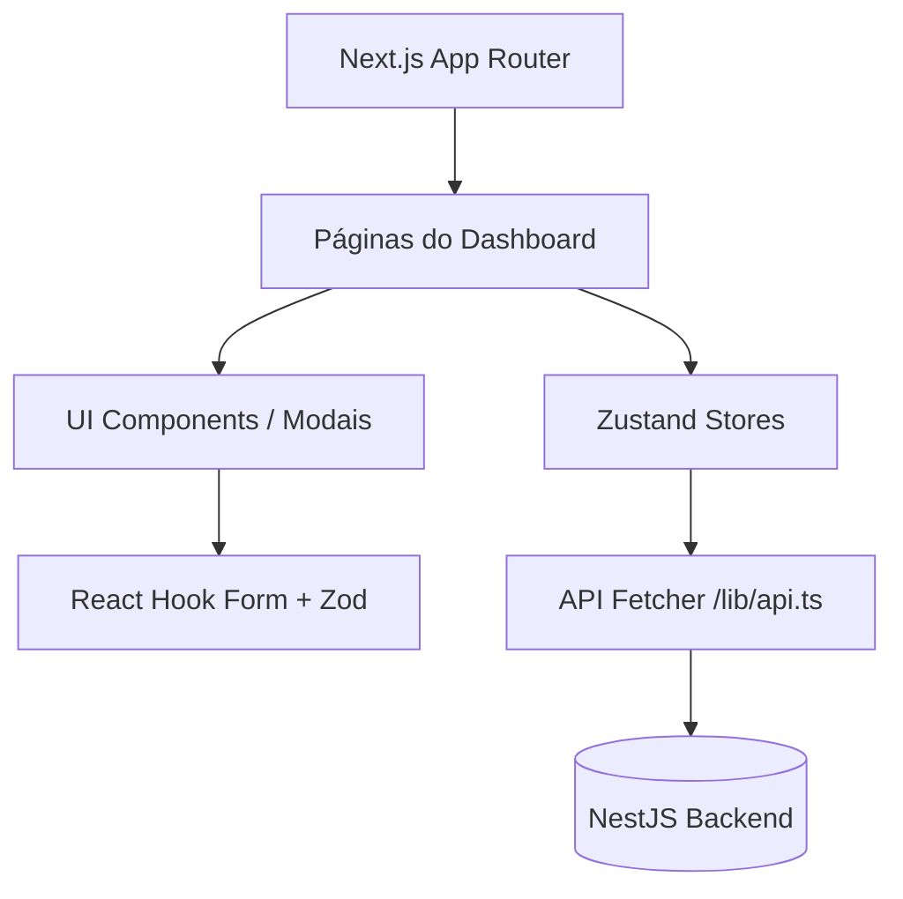

# 🎨 Documentação de Desenvolvimento do Frontend — NEXA

Esta documentação serve como guia técnico oficial do frontend da **NEXA** (desenvolvido em **Next.js 16 (App Router), React 19 & TypeScript**). O objetivo é facilitar a manutenção, o entendimento da arquitetura de estados e o reaproveitamento de componentes visuais.

---

## 🏗️ 1. Arquitetura Geral & Estrutura

O frontend segue uma arquitetura baseada em **Componentes Reutilizáveis (UI Kit)** e **Gerenciamento de Estado Reativo (Zustand)**, comunicando-se com o backend através de uma camada utilitária central.



### 📂 1.1. Estrutura de Diretórios
- `src/app/`: Configuração de rotas usando o App Router do Next.js (com suporte nativo a `loading.tsx`, `error.tsx` e `not-found.tsx`).
- `src/components/ui/`: Biblioteca de componentes reutilizáveis e agnósticos (Botões, Modais, Inputs, Avatares, Badges, etc).
- `src/components/layout/`: Elementos estruturais globais (`Sidebar`, `Topbar`, `AIChatPanel`).
- `src/components/modals/`: Interfaces sobrepostas de lógicas complexas (Cadastros, Assinaturas, Demandas).
- `src/stores/`: Gerenciadores globais de estado usando **Zustand**.
- `src/schemas/`: Esquemas de validação rígida utilizando **Zod**.
- `src/lib/`: Utilitários gerais (`utils.ts`, camada `api.ts`, `auth-store.ts`).
- `src/types/`: Tipagens TypeScript globais centralizadas (`index.ts`).

---

## 🧩 2. Componentes Reutilizáveis (UI Kit)

O projeto migrou de códigos duplicados para componentes atômicos. Qualquer nova interface deve priorizar o uso desses blocos construtivos:

- `<Modal />`: Componente composto (`Modal.Header`, `Modal.Body`, `Modal.Footer`) que gerencia overlay, animações e atalhos de fechamento (tecla `Esc`).
- `<Input />`: Wrapper que integra label, hint, e mensagens granulares de erro (suporta variante `Textarea`).
- `<Button />`: Botão padronizado com suporte nativo a estado de loading (spinner) e variantes (`primary`, `secondary`, `danger`, `ghost`).
- `<Badge />` e `<StatusBadge />`: Exibição visual de status coloridos e padronizados baseados no `getStatusColor` e `getStatusLabel`.
- `<ConfirmDialog />`: Pop-up de dupla checagem com suporte a ações críticas (`variant="danger"`).
- `<AdicionarMembroModal />` (Novo!): Modal premium em dark-mode com glassmorphism, permitindo que administradores e estagiários Nível 2 incluam novos integrantes à equipe do projeto com percentuais específicos de produtividade e progresso inicial.
- **Modal de Confirmação de Remoção de Membro** (Novo!): Diálogo interativo customizado de dupla checagem (substituindo o `confirm()` padrão), integrado com ícone de alerta piscante, indicativo de efeitos colaterais de banco de dados e botão de ação destrutiva com suporte a *Loading* reativo.
- `<StatCard />`: Card para exibir KPIs com valores computados e indicadores de tendência. Totalmente refatorado para suportar interatividade avançada: navegação automática usando Next.js `<Link href="..." />` ou execução de gatilhos locais via evento `onClick` (ex: abertura de modais), com feedback visual de hover e ponteiro de mouse clicável.
- `<Avatar />`: Geração de iniciais dinâmicas com cores consistentes baseadas no *hash* do nome do colaborador.
- `<EmptyState />`: Interface de feedback amigável quando listas (tabelas, clientes, projetos) estão vazias.

---

## ⚡ 3. Gerenciamento de Estado & Dados (Zustand)

O ecossistema aboliu o uso de *mocks globais diretos*, passando a delegar os dados em cache de memória reativa por meio do **Zustand**. As stores puxam pacotes de dados do Backend via dumps e os gerenciam ativamente.

### 🏪 3.1. Stores Ativos
- `useProjectStore`: Armazena projetos, demandas, contratos, membros e entregas (agora sincronizado com a API real, incluindo envios Multipart, fallback de entregas, bem como métodos assíncronos para adicionar (`addProjectMember`) e remover (`removeProjectMember`) membros da equipe).
- `useUserStore`: Lista reativa de usuários do sistema (estagiários, gestores e professores).
- `useTicketStore`: Gerencia os chamados de suporte e o chat do ticket, agora protegido contra mutações síncronas quebras.
- `useFinancialStore`: Tabela global reativa de despesas e receitas. Comporta selectors automáticos como `getTotalRevenue()` e `getOverdue()`.
- `useAuthStore`: Persistência de token no frontend SSR via cookies HttpOnly. Limpeza total de Stores no Logout garantida para evitar vazamento de dados de sessão.

### ⏱️ 3.2. Paginação e Loading States (UX)
- Ao interagir com listagens extensas, o Zustand gerencia estados de carregamento (`isLoading`) que substituem tabelas vazias por `Skeletons` (Spinners), proporcionando uma experiência contínua e prevenindo acessos a dados nulos na renderização.

---

## 🛡️ 4. Validação e Formulários (React Hook Form + Zod)

A coleta de dados pelo usuário não depende mais de verificações manuais fracas (ex: `if (!nome)`). Adotou-se o fluxo profissional:

1. **Schemas Zod**: Todo domínio possui um esquema validador em `src/schemas/` (ex: `createProjectSchema`, `createFinancialEntrySchema`).
2. **Hook Form**: Os Modais aplicam a camada do `react-hook-form` conectada ao `@hookform/resolvers/zod`.
3. **Erros Visualizados**: Se o usuário digita um CNPJ incorreto ou um valor financeiro inválido, as mensagens descritivas do Zod aparecem nativamente abaixo do `<Input />`.

---

## 🧭 5. Navegação Inteligente & Restrições do Cliente (Client Views)

Com o objetivo de simplificar e proteger a experiência de uso do papel de Cliente (`Role.CLIENTE`), implementamos regras de controle de acesso visual e navegação otimizada no painel de projetos:

### 🚦 5.1. Restrição Dinâmica de Abas
* O Cliente visualiza apenas as abas **"Visão Geral"**, **"Entregas"**, **"Timeline"** e **"Contratos"**. As abas que contém dados de trabalho interno do time, como *"Demandas"*, *"Equipe"* e *"Arquivos"*, são dinamicamente omitidas com base na propriedade `user?.role`.
* A validação de montagem da página previne acessos manuais maliciosos através da URL (ex: `?tab=demands`), ignorando o parâmetro e mantendo o cliente na aba autorizada.

### 📐 5.2. Ocultação Contábil e Redimensionamento de Grid (Overview)
* O bloco de **"Resumo Financeiro"** na aba **"Visão Geral"** do projeto foi totalmente removido para usuários clientes.
* Para garantir a estética de ponta do NEXA, o painel de **"Membros da Equipe"** se expande automaticamente para ocupar **100% da largura da tela (`w-full`)** quando o usuário ativo for um Cliente. Nos demais papéis do sistema, o grid clássico balanceado de 2 colunas permanece ativo.

### 🔗 5.3. Foco de Aba no Mount (URL Query Param)
* A página de detalhes do projeto escuta parâmetros de consulta da URL através de um hook `useEffect` isolado e seguro para o cliente (evitando problemas de SSR em tempo de build).
* Passar o parâmetro `?tab=contracts` fará com que a página seja montada com o foco ativo diretamente sobre a aba de Contratos, viabilizando fluxos diretos a partir de cliques em cards ou notificações.

### 🛡️ 5.4. Liberação das Políticas de CSP (Content Security Policy)
Para permitir que o visualizador de PDF oficial incorporado em `<iframe>` carregue e renderize os contratos hospedados na API do backend sem bloqueios de segurança do navegador, atualizamos as políticas CSP no arquivo `next.config.ts` do frontend:
* `frame-src 'self' http://localhost:3001;` -> Autoriza a incorporação física do frame carregado do backend.
* `object-src 'self' http://localhost:3001;` -> Permite plugins nativos de PDF do navegador.

### 🔑 5.5. Redirecionamento Obrigatório de Troca de Senha (Primeiro Acesso)
* Implementado um modal interceptor bloqueante global no `DashboardLayout`.
* Se a conta do usuário possuir a flag `password_needs_change === true` (definida automaticamente no cadastro de novos clientes/colaboradores), o layout impede interações, oculta a navegação normal e força o preenchimento de uma nova senha segura.
* O modal valida em tempo real critérios de segurança avançados (mínimo de 8 caracteres, contendo pelo menos uma letra e um número) e despacha a requisição para `POST /auth/change-password`, liberando o dashboard somente após o sucesso da transação.

### 📊 5.6. Painel de Armazenamento do Supabase e PostgreSQL
* Adicionado na aba **"Manutenção & Backups"** da tela de configurações (`/dashboard/configuracoes`), acessível unicamente a gestores (`Role.NIVEL_3`).
* Consome os dados reais do backend via hook reativo que monitora o uso de bytes do banco PostgreSQL e do Bucket Supabase Storage.
* Renderiza cards interativos com barras de progresso modernas (com transições dinâmicas e cores semânticas) alinhados às cotas do plano gratuito do Supabase (500 MB de banco de dados e 1 GB de armazenamento de arquivos), com suporte a atualização sob demanda por clique.

---

## 🔗 6. Integração com o Backend Seguro

O frontend deixou de ser isolado. Ele utiliza um Hub Utilitário (`src/lib/api.ts`) para falar com o servidor.

### 🌐 6.1. Camada `api.ts`
- **Injeção Automática de JWT**: Toda requisição feita usando `apiFetch('/recurso')` adiciona automaticamente o header `Authorization: Bearer <TOKEN>`.
- **Suporte Inteligente a Payloads**: O utilitário injeta `application/json` por padrão, mas reconhece automaticamente quando um objeto `FormData` é passado (para envio físico de arquivos reais), delegando ao navegador o gerenciamento de *boundaries* do `multipart/form-data`.
- **Tratamento Global de 401**: Se o token expirar ou o back-end rejeitar por falta de permissão, o interceptador do `apiFetch` desconecta o usuário forçadamente (`useAuthStore.getState().logout()`).
- **Retorno Seguro**: O utilitário processa JSON e trata retornos nulos nativamente, lançando exceções limpas para serem capturadas por `try/catch` nos botões do frontend.

### 💬 6.2. Nexa AI Chat e Busca Global
O componente `AIChatPanel` não usa mais `setTimeout` inventados. Ele realiza despachos reais para a API de Inteligência Artificial do Backend (via Gemini), garantindo que os usuários tenham dados vivos no assistente corporativo. A Topbar também implementa um recurso de **Busca Global Instantânea**, que realiza varreduras em memória nos Stores (`Zustand`) proporcionando autocompletar e dropdowns rápidos sem gargalo de rede.

### 🔔 6.3. WebSockets (Notificações em Tempo Real)
Foi integrado o cliente `socket.io-client` encapsulado no Hook global genérico `useSocket.ts`. Injetado no layout do Dashboard, ele reage ativamente às atualizações de backend (como novos comentários de chamados) e exibe "Toasts" usando a UI, proporcionando tempo real para todos os administradores logados.

### 📄 6.4. Exportações Client-Side
Foi desenvolvida e plugada na aba Financeira a biblioteca `jspdf` com `jspdf-autotable`. Ela captura o array visual já filtrado de relatórios do Zustand e imprime diretamente pelo navegador o arquivo `financeiro.pdf` formatado, isentando a API de processamento massivo de arquivos PDFs transacionais.

---

## 💻 7. Como Executar e Compilar o Frontend

### Requisitos
- Node.js (v18+)
- Backend rodando paralelamente na porta `3001` (por padrão).

### Comandos Úteis
```bash
# 1. Instalar dependências
npm install

# 2. Rodar em modo Desenvolvimento (Next.js App Router)
npm run dev

# 3. Rodar Linter de Qualidade
npm run lint

# 4. Compilar Tipagem Estrita e Produção
npm run build

# 5. Iniciar Servidor de Produção
npm run start
```

> [!TIP]
> **Modificações Contínuas**: Todo novo campo exigido no formulário de backend deve refletir em uma dupla atualização: no `src/types/index.ts` (TypeScript Interface) e no correspondente validador do `src/schemas/` (Zod Schema). Isso previne a quebra da validação bidirecional do projeto.
